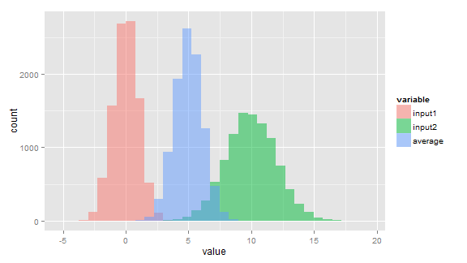

## Summary
In this presentaion, averge of two samples which are sampled from normal distribution with different parameters is calculated. Histogram of both input distribution and average distribution is dipicted. 

## Description
Two sample sets named `input1` and `input2`, with size `nsamp` are prepared. Parameter of `input1` and `input2` are their means and standard deviations. For `input1`, mean is `mu1`, standard deviation is `sd1`. Same rule is applied for `input2`.

Each elements from two sample sets are averaged. And new sample set `average` is generated. Then, mean and standard deviation of average distribution is calculated.

Number of sample `nsamp` is set to 10000. Parameter of `input1` is `mu1 = 0, sd1 = 1`. And for `input2`, they are `mu2 = 10, and sd2 = 2`. Seed is set to 111. 

---

## Sampling and calculation

```r
set.seed(111)
library(reshape)
library(ggplot2)

nsamp <- 10000 #number of each sample set
mu1 <- 0; sd1 <- 1; mu2 <- 10; sd2 <- 2 #parameter of inputs

input1 <- rnorm(nsamp,mean=mu1,sd=sd1)
input2 <- rnorm(nsamp,mean=mu2,sd=sd2)
average <- (input1+input2)/2 #sampling and calculation of average

mu3 <- mean(average); sd3 <- sd(average) #parameter of averaged sample sets
```

---

    
## Plotting histogram

```r
df <- melt(data.frame(input1,input2,average)) 
```

```
## Using  as id variables
```

```r
#conversion to dataframe for histogram with multiple distributions

g <- ggplot(df,aes(x=value,fill=variable))
g <- g + geom_histogram(alpha=0.5,position="identity")
```

---

## Results
Histogram of `input1` is plotted with red. For `input2`, it is green. `average` distribution is dipicted with blue histogram.

 
mu3 = 5, sd3 = 1.12

It is indicated that averaged samples are normally distributed, with parameters $average \sim N(\frac{mu1+mu2}{2},(\frac{sd1}{2})^2+(\frac{sd2}{2})^2)$.
